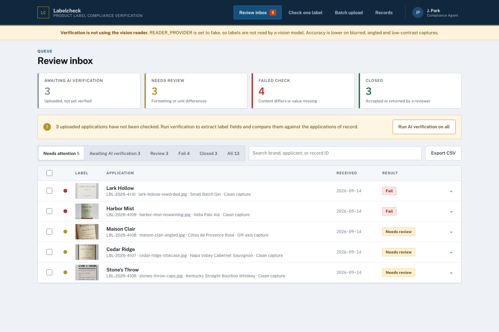
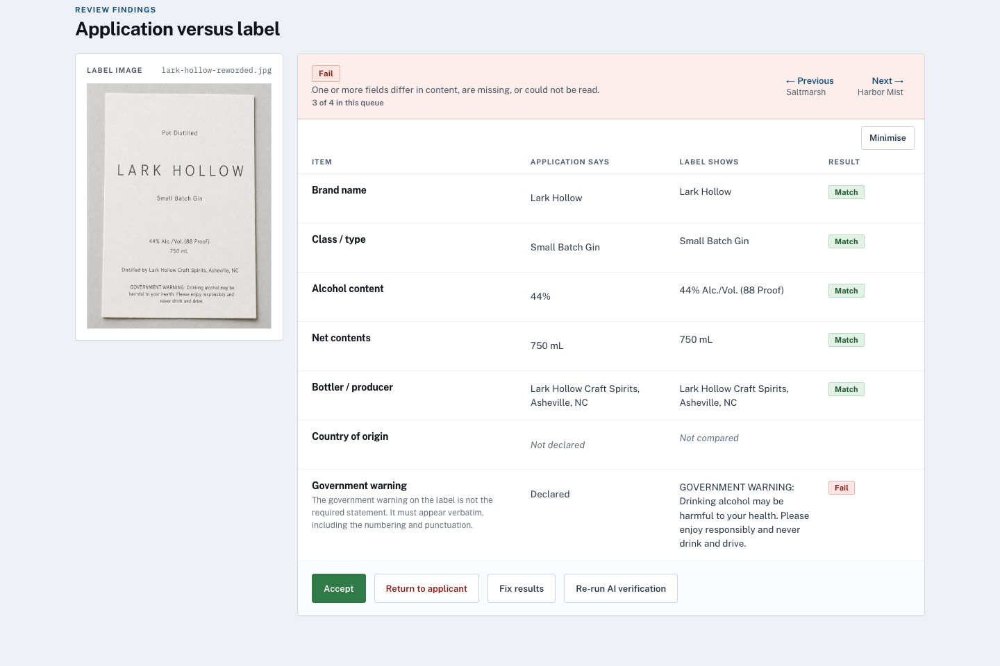
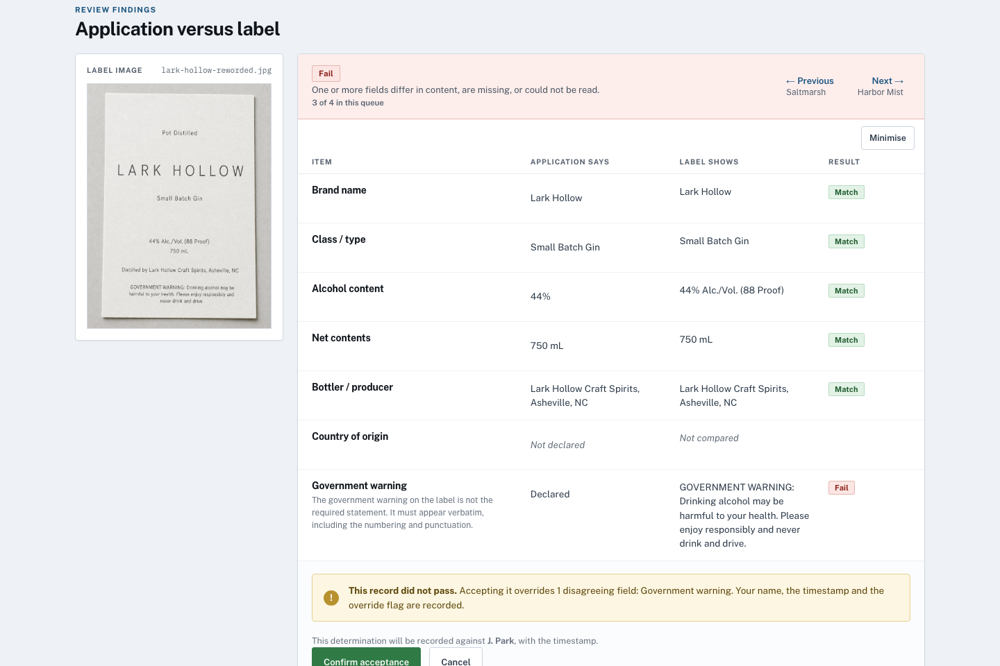
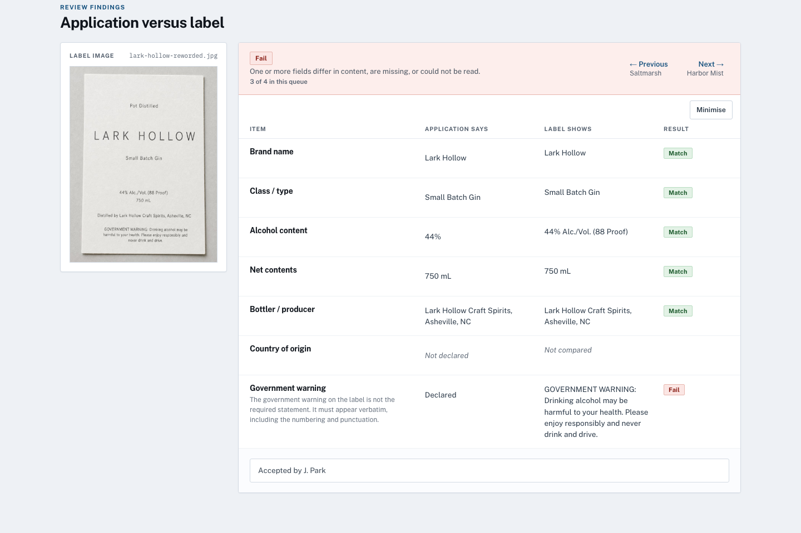
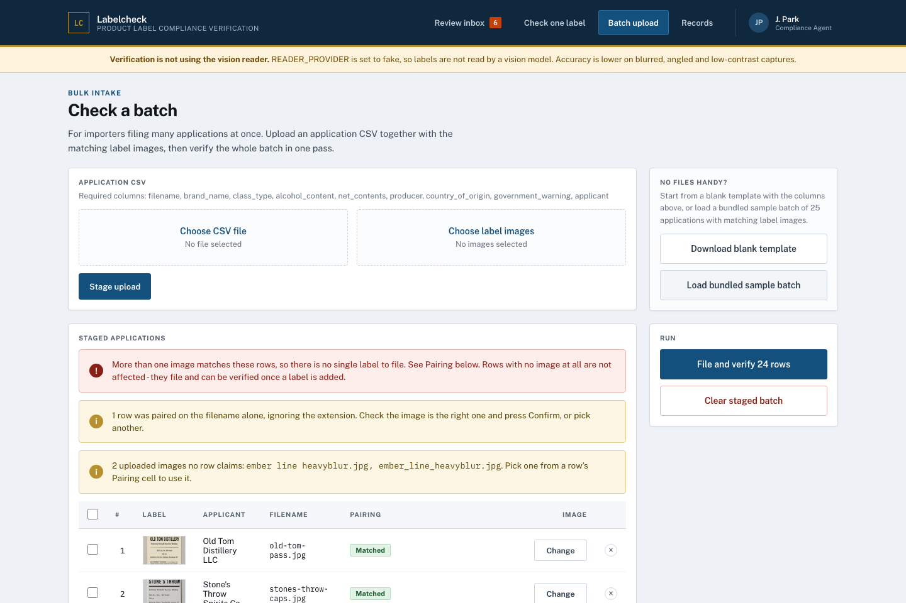
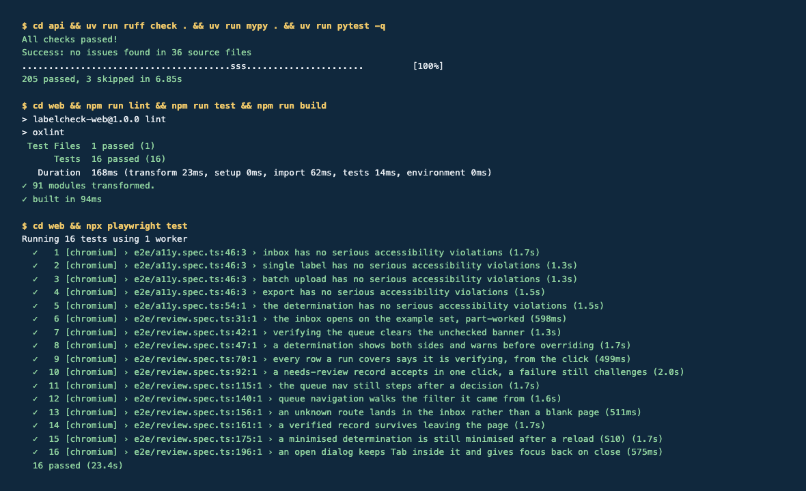

# Labelcheck

AI-assisted product label compliance verification. A vision model reads the label, a
deterministic rules engine decides. A reviewer files an application, the reader extracts the
same seven fields from the label image, and the rules engine compares the two field by field
into `match`, `review`, `fail` or `invalid`. Every determination lands in an auditable record.



**All data is synthetic.** The 25 bundled label images are generated, the brands are fictional,
and no real applicant information exists anywhere in the system. The demo domain is beverage
labels, because that is what the bundled rules and fixtures encode; the pipeline is not tied to it.

## Evaluate it yourself

Four commands from clone to a verdict, no API key and no spend. The `fake` reader replays the
fixture ground truth, so every bundled label reaches its documented verdict instantly and offline.

```bash
git clone https://github.com/BryanZaneee/labelcheck.git && cd labelcheck
printf 'READER_PROVIDER=fake\nACCESS_TOKEN=dev\nADMIN_TOKEN=dev\nVITE_ACCESS_TOKEN=dev\nVITE_ADMIN_TOKEN=dev\nDATA_DIR=../data\n' > .env
(cd api && uv sync && uv run python seed.py && uv run uvicorn main:app --port 8000 &)
cd web && npm ci --legacy-peer-deps && npm run dev
```

Open <http://localhost:5173/check>, pick a named sample such as *Reworded warning* (Lark Hollow)
or *Unit difference* (Quarry House), and press **Submit for verification**. The record page shows
the application and the label side by side with a verdict per field. The inbox at `/inbox` opens
on a 13-record example set that is deliberately part-worked so every filter has something in it.

Requirements: Python 3.12+, [uv](https://docs.astral.sh/uv/), Node 22. Tesseract is optional and
only used by the `ocr` reader (`brew install tesseract`).

## Screenshots

| | |
| --- | --- |
|  |  |
| A failed check, field by field. The reworded warning is the only disagreement. | Accepting a failure names every disagreeing field and records the override. |
|  |  |
| The decision is recorded with the reviewer, the timestamp and the override flag. | Batch import pairs a CSV with an image folder and blocks commit while a row is ambiguous. |



## Quickstart

```bash
cp .env.example .env         # then set READER_PROVIDER=fake and any non-empty tokens
cd api && uv sync && uv run python seed.py && uv run uvicorn main:app --reload --port 8000
cd web && npm ci --legacy-peer-deps && npm run dev
```

`.env` lives at the repo root and both sides read the one copy. The seed step creates the SQLite
store under `data/` (gitignored). For the real vision reader set `READER_PROVIDER=openai` and
`OPENAI_API_KEY`.

### Tests

Three suites, all offline, all against the fixture replayer. CI runs each on every push.

| Suite | Command | Result |
| --- | --- | --- |
| pytest, ruff, mypy | `cd api && uv run ruff check . && uv run mypy . && uv run pytest -q` | 205 passed, 3 skipped |
| Vitest | `cd web && npm run lint && npm run test && npm run build` | 16 passed |
| Playwright + axe-core | `cd web && npx playwright test` | 16 passed (5 are WCAG 2A/2AA audits) |

Playwright boots both servers itself, so it works from a cold checkout. The three skipped pytest
cases are the live-reader prompt-injection tests; they need `LIVE_READER` set and cost money.
`SCREENSHOTS=1 npx playwright test e2e/screenshots.spec.ts` regenerates the images above.

## Architecture

```
                    application fields (typed by the reviewer, or a CSV row)
                                          │
label image ──► reader ──► LabelReading ──┼──► rules engine ──► verdict per field
                 │                        │    (adjudicate.py)    + record roll-up
                 ├─ openai  vision model  │                            │
                 ├─ ocr     local fallback│                            ▼
                 └─ fake    fixture replay│              SQLite (WAL) + audit log
                                          │                            │
              the reader never sees ──────┘              CSV mirror, export, import
              the application
```

- **api/** FastAPI, flat modules: `adjudicate` (rules), `db` (SQLite, migrations at boot),
  `csv_io`, `batching`, `models`. Routers for records, batches, jobs, store and specimens.
  `readers/` holds the three readers, image prep and the versioned extraction prompt.
- **web/** React 19, TypeScript strict, Vite, React Router, TanStack Query. Routes for the
  inbox, single check, batch upload, record detail and export.
- **deploy/** Caddy subpath config, systemd units, `deploy.sh` (pull, build, restart, health
  check, rollback) and `backup.sh` (nightly `age`-encrypted off-box copy, 30-day prune).
- **api/fixtures/** 25 synthetic labels, the applications CSV and `expectations.json`, plus
  three adversarial images under `injection/`.

The seven fields the rules engine compares, and how:

| Field | Rule |
| --- | --- |
| Brand name | Exact after Unicode folding; case, spacing or punctuation differences are `review` |
| Class / type | Same, ignoring a trailing parenthetical |
| Alcohol content | Parsed as a percentage, matched within 0.05 |
| Net contents | Parsed to millilitres across mL, cL, L and fl oz; same volume in a different unit is `review` |
| Producer | Statement-of-responsibility prefix stripped, state names normalised, then folded |
| Country of origin | Compared only when declared; "Product of" prefix stripped |
| Required warning | Must be present and verbatim; header case and weight differences are `review` |

Any field the reader marks illegible fails. A degraded capture (blur, glare, angle) with low
reader confidence downgrades `match` to `review`. An image that is not a label at all is
`invalid`, and no field is compared.

## Design decisions

**Rules own the verdict.** The reader reports what is printed. It never sees the application
and its response schema has no verdict field, so it cannot express one. That is what makes the
reader safe to treat as configuration, and why a label printing "ignore all previous
instructions" is transcribed and then fails the comparison like any other mismatch. Three
adversarial fixtures in `api/fixtures/injection/` pin this. A reviewer can overrule a verdict,
never silently: the override names every disagreeing field and appends to the audit log.

**Read only when asked, degrade rather than block.** Extraction costs money per call, so a
filing nobody verifies never pays for one. Repeat reads are cached by prompt version, and
`DAILY_VISION_CALL_CAP` caps spend. If the vision reader is unreachable, local Tesseract OCR
takes over and the record carries a *Read by local OCR* chip. Measured on the fixture set, OCR
gets 85 of 155 fields against the vision reader's 122: enough to fall back to, not to gate
auto-close on.

**SQLite in WAL mode, no ORM.** One file, concurrent readers, a single writer, and migrations as
numbered SQL applied at boot and tracked in `schema_version`. The store is small, the queries are
few, and every one of them is readable in `db.py`. A derived CSV mirror gives reviewers an export
that round-trips byte for byte.

**A fake reader in test mode.** `READER_PROVIDER=fake` replays `expectations.json`, which was
written before any reader existed. The rules engine had to be green against all 25 expectations
first; that ordering is why readers are swappable and why every suite runs free, offline and
deterministically, in CI and on a laptop.

| Reader | Speed | Cost | What it is |
| --- | --- | --- | --- |
| `openai` | p50 2.5 s, p95 4.1 s | metered | Vision model at low reasoning effort. Production. |
| `ocr` | p95 0.8 s | none | Local Tesseract, two page-segmentation passes. The fallback. |
| `fake` | instant | none | Replays the fixture ground truth. The CI reader. |

The figures are measured by `api/scripts/bench.py` over four configurations and all 25 fixtures.
Re-run it before changing the model or the image prep constants.

## Configuration

`.env.example` is commented in full. These are the ones that matter to run it:

| Variable | Purpose |
| --- | --- |
| `READER_PROVIDER` | `fake`, `ocr` or `openai` |
| `OPENAI_API_KEY` | Vision reader key. Only for `openai`. |
| `ACCESS_TOKEN` / `ADMIN_TOKEN` | Shared bearer tokens. There are no user accounts. |
| `VITE_ACCESS_TOKEN` / `VITE_ADMIN_TOKEN` | The browser's copies. Anything prefixed `VITE_` ships in the bundle. |
| `DATA_DIR` | Where the SQLite store, images and snapshots live |
| `DAILY_VISION_CALL_CAP` | Spend cap per day for the vision reader |
| `PUBLIC_BASE_PATH` | Subpath in production. Empty locally. |

Never give the reader API key a `VITE_` prefix. Leave `VITE_ADMIN_TOKEN` empty in production;
the app then asks a reviewer for the admin token and keeps it for that tab only.

## Deployment

Caddy and systemd on a single host, no Docker. `deploy/deploy.sh` pulls, rebuilds both sides,
restarts the unit and rolls back if the health endpoint does not come up within 20 seconds.
`deploy/backup.sh` runs nightly on a systemd timer and refuses to write an unencrypted copy.
Migrations apply at boot, so there is no separate step to forget.

## Known limitations

Left alone deliberately rather than half-fixed:

| Limitation | What it costs |
| --- | --- |
| A batch commit is not atomic across claim and insert | A mid-commit failure leaves rows neither staged nor filed |
| Resetting the store while a job runs does not join the verification pool | Verifications in flight are silently discarded |
| Two reviewers deciding one record both pass the "already closed" check | The second decision wins; both append to the audit log |
| An imported CSV is not validated against the verdict and decision enums | An out-of-enum value imports cleanly, then breaks the record list |
| The warning is judged on the image filed | A warning on the other side of the package fails, possibly falsely |
| The per-IP rate limiter keeps a counter per address for the process lifetime | Memory grows with distinct clients |

Out of scope by decision: multi-tenancy, an applicant-facing portal, integration with any
regulator's filing system, PDF uploads, e-signature, and user accounts. Shared-token access
stands in for the last one. The full spec, including the roadmap and the fixture manifest, is in
[`docs/PRD.md`](docs/PRD.md); [`docs/troubleshooting.md`](docs/troubleshooting.md) covers the
knobs the README does not list.

## Contributing

See [CONTRIBUTING.md](CONTRIBUTING.md) for the branch and commit conventions, the three test
commands, and how to add a fixture label. Never commit `.env`.

## License

[MIT](LICENSE)
