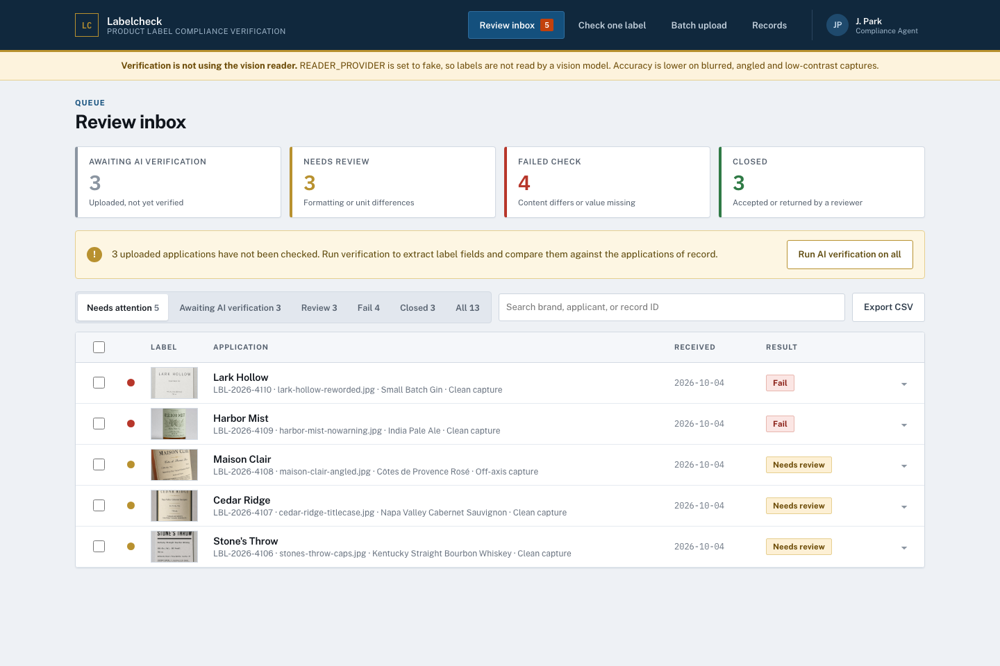

# Labelcheck

An AI-assisted label review tool that compares product labels with filed applications.



*The review inbox, populated from fictional label fixtures.*


*Seven fields compared by deterministic rules; a vision model transcribes the label.*

[Batch import and audit screenshots](docs/guide.md#screenshots).

## Try it

Open the [hosted demo](https://bryanzane.com/labelcheck/) or follow the local
quickstart below. Choose a fictional sample label, submit it, and inspect the
field-by-field verdict. The fake reader runs offline without API spend.

## Quickstart

```bash
# From the repository root; Python 3.12+, uv, and Node 22 are required.
cp .env.example .env         # then set READER_PROVIDER=fake and any non-empty tokens
(cd api && uv sync && uv run python seed.py && uv run uvicorn main:app --reload --port 8000)
(cd web && npm ci --legacy-peer-deps && npm run dev)
```

`.env` lives at the repo root and both sides read the one copy. The seed step creates the SQLite
store under `data/` (gitignored). Ships with 25 sample labels (fictional brands) so every screen
has data. For the real vision reader set `READER_PROVIDER=openai` and `OPENAI_API_KEY`.

### Tests

Three suites, all offline, all against the fixture replayer. CI runs each on every push.

```bash
(cd api && uv run ruff check . && uv run mypy . && uv run pytest -q)   # pytest, ruff, mypy
(cd web && npm run lint && npm run test && npm run build)              # Vitest
(cd web && npx playwright test)                                        # Playwright + axe-core
```

Playwright boots both servers itself, so it works from a cold checkout. The skipped pytest
cases are the live-reader prompt-injection tests; they need `LIVE_READER` set and cost money.
`cd web && SCREENSHOTS=1 npx playwright test e2e/screenshots.spec.ts` regenerates the images above.

## Configuration

`.env.example` is commented in full. These are the ones that matter to run it:

| Variable | Purpose |
| --- | --- |
| `READER_PROVIDER` | `fake`, `ocr` or `openai` |
| `OPENAI_API_KEY` | Vision reader key. Only for `openai`. |
| `ACCESS_TOKEN` / `ADMIN_TOKEN` | Shared bearer tokens. There are no user accounts. |
| `VITE_ACCESS_TOKEN` / `VITE_ADMIN_TOKEN` | The browser's copies. Anything prefixed `VITE_` ships in the bundle. |
| `DATA_DIR` | Where the SQLite store, images and snapshots live |
| `DAILY_VISION_CALL_CAP` | Spend cap per day for the vision reader |
| `MAX_JOB_RECORDS` | Records a single verify job can fan out to at once |
| `PUBLIC_BASE_PATH` | Subpath in production. Empty locally. |

Never give the reader API key a `VITE_` prefix. Leave `VITE_ADMIN_TOKEN` empty in production;
the app then asks a reviewer for the admin token and keeps it for that tab only.

## Deployment

Caddy and systemd on a single host, no Docker. `deploy/deploy.sh` pulls, rebuilds both sides,
restarts the unit and rolls back if the health endpoint does not come up within 20 seconds.
`deploy/backup.sh` runs nightly on a systemd timer and refuses to write an unencrypted copy.
Migrations apply at boot, so there is no separate step to forget.

## Architecture and limits

FastAPI owns readers, deterministic rules, SQLite records, and the audit log;
React provides the reviewer interface. Shared tokens replace user accounts.
This is a review aid, not a regulator integration or a multi-tenant service.
See the [architecture, design decisions, and known limits](docs/guide.md),
[specification](docs/PRD.md), and [troubleshooting](docs/troubleshooting.md).

## Contributing

See [CONTRIBUTING.md](CONTRIBUTING.md) for the branch and commit conventions, the three test
commands, and how to add a fixture label. Never commit `.env`.

## License

[MIT](LICENSE)
